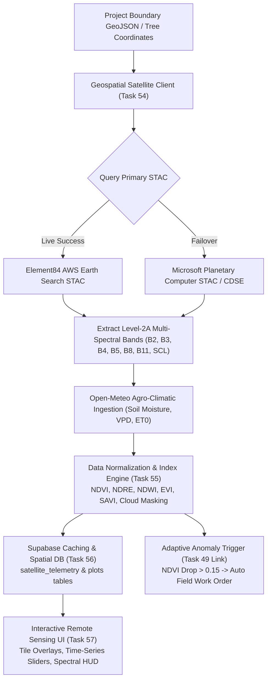

# HIRWA SPARSH / GREEN ENLIGHTENMENT — PHASE 10
## Remote Sensing & Satellite Telemetry Technical Specification & Provider Research

**Project**: Hirwa Sparsh MRV Engine  
**Document Version**: 1.0.0  
**Target Region**: Indian Agroforestry & Afforestation Basins (Western Ghats, Deccan Plateau, Eastern Ghats, Central Highlands, Indo-Gangetic Plains) + Global Arid/Tropical Carbon Projects  
**Compliance Standards**: Verra VM0047, Gold Standard Afforestation/Reforestation, IPCC Tier-2 Biomass Accounting, UNFCCC REDD+ MRV  

---

### Executive Summary

To ensure institutional legitimacy, compliance with carbon registries (Verra, Gold Standard, UNFCCC), and authentic ecological surveillance, Hirwa Sparsh **does not use mock or placeholder satellite telemetry**. 

Phase 10 deploys a multi-tier, real-time remote-sensing pipeline leveraging open **SpatioTemporal Asset Catalogs (STAC)**, **Copernicus Sentinel-2 Level-2A (Bottom-of-Atmosphere)** surface reflectance, **NASA Landsat 8/9**, **NASA GEDI Spaceborne LiDAR**, and **Open-Meteo Agro-Climatic Telemetry**.

---

### 1. Provider Comparison & Selection Matrix

| Provider / Pipeline Tier | Primary Data Source | Spatial Resolution | Temporal Resolution | Licensing | API / Access Method | Cost | Rate Limits | Recommended Role |
| :--- | :--- | :--- | :--- | :--- | :--- | :--- | :--- | :--- |
| **Tier 1: Copernicus Sentinel-2 (ESA / AWS Earth Search)** | Sentinel-2A / 2B / 2C Multi-Spectral Instrument (MSI) Level-2A BOA | **10m** (B2, B3, B4, B8)<br>**20m** (B5-B7, B8A, B11, B12)<br>**60m** (B1, B9, B10) | **5 Days** (Constellation)<br>*(2-3 days in mid-latitudes)* | **Open & Free** (EU Copernicus Data Policy, CC-BY equivalent) | **STAC API v1** (Element84 / AWS Open Data)<br>Direct COG asset streaming via S3/HTTPS | **$0.00** (100% Free Open Data) | ~10 req/s unauthenticated; CDN cached | **Primary Operational Engine** for NDVI, NDRE, NDWI, EVI, and Canopy Health. |
| **Tier 2: Copernicus Data Space Ecosystem (CDSE) / Sentinel Hub** | Sentinel-2 L2A & Sentinel-1 SAR (GRD - Synthetic Aperture Radar) | 10m Optical / 10m C-Band SAR Dual-Pol (VV/VH) | 5-6 Days | **Open & Free** (Copernicus) | **OData REST / Sentinel Hub Process API** (Evalscript band math on-the-fly) | Free tier included (5,000 requests/month free) | 100 req/min free quota | **Deep Spectral Math & Cloud-Penetrating SAR** for monsoon cloud coverage. |
| **Tier 3: Microsoft Planetary Computer STAC** | Sentinel-2 L2A, Landsat 8/9 C2-L2, NASA GEDI L2A/L4A | 10m (S2), 30m (Landsat), 25m footprint (GEDI) | 5 Days (S2), 8-16 Days (Landsat) | **Open Access** | **STAC API v1.0** with SAS Token signing for Azure Blob COG streaming | **$0.00** (Free for open scientific/climate use) | 100 req/min for SAS token issuance; uncapped COG stream | **High-Availability Fallback & Historical Baseline** (50-year Landsat record). |
| **Tier 4: Open-Meteo Agro-Climatic API** | ECMWF ERA5, DWD ICON, GFS, NASA GPM Precipitation | 1 km to 11 km regional grid | **Hourly / Daily** (Real-time + 1940-present archive) | **Open Data** (ODbL / CC-BY 4.0) | **REST API** (`https://api.open-meteo.com/v1/forecast` & `archive`) | **$0.00** (Free tier up to 10,000 calls/day) | 10,000 calls/day, 600 calls/min, 10 calls/sec | **Microclimate & Soil Drought Stress Correlation** (VPD, Soil Moisture 0-7cm/7-28cm, ET0). |
| **Tier 5: NASA GEDI & ICESat-2 (Spaceborne LiDAR)** | GEDI on ISS (Full Waveform LiDAR) & ICESat-2 ATLAS | 25m circular footprint transects | Orbital passes (2019-present) | **NASA Open Data** (Public Domain) | **NASA Earthdata CMR API** / ORNL DAAC / Planetary Computer STAC | **$0.00** (Free) | Standard NASA Earthdata Bearer Token | **Ground-Truth Canopy Height Calibration** (RH50, RH75, RH98, Aboveground Biomass density). |
| **Tier 6: PlanetScope / SkySat (Commercial Extension)** | PlanetScope SuperDove 8-band & SkySat 50cm | 3.0m (PlanetScope)<br>0.5m (SkySat) | **Daily Revisit** | Commercial / **NICFI Free Tier** (for tropical forest zones) | **Planet REST API v1** & XYZ Tile Services | Commercial ($/km²) or Free under NICFI Climate Grants | 10 req/s with API Key | **Sub-Plot Single-Tree Crown Delineation** (Optional enterprise add-on). |

---

### 2. Primary Provider Architecture: Copernicus Sentinel-2 L2A via Element84 STAC & CDSE

#### A. Imagery Source & Processing Level
- **Instrument**: Sentinel-2 Multi-Spectral Instrument (MSI).
- **Processing Level**: **Level-2A (L2A)** Bottom-of-Atmosphere (BOA) surface reflectance.
  - Atmospheric correction executed via **Sen2Cor** processor (correcting for Rayleigh scattering, aerosols, water vapor, ozone).
  - Includes **Scene Classification Layer (SCL)** providing 20m cloud, cloud shadow, cirrus, vegetation, bare soil, and water masks.
- **Spectral Bands Utilized**:
  - `B02` (Blue, 490 nm, 10m) — Atmospheric scattering correction & EVI.
  - `B03` (Green, 560 nm, 10m) — Foliar health & NDWI water index.
  - `B04` (Red, 665 nm, 10m) — Chlorophyll-a absorption & NDVI baseline.
  - `B05` (Red Edge 1, 705 nm, 20m) — Early physiological plant stress & NDRE.
  - `B08` (NIR Broad, 842 nm, 10m) — Canopy cellular structure scattering & biomass.
  - `B8A` (NIR Narrow, 865 nm, 20m) — Precision water vapor / biomass allometry.
  - `B11` (SWIR 1, 1610 nm, 20m) — Foliar moisture content & NDRE/NDWI.
  - `SCL` (Scene Classification Layer, 20m) — Cloud masking & pixel quality validation.

#### B. Spatial & Temporal Resolution
- **Ground Sample Distance (GSD)**:
  - 10 meters per pixel for core vegetation indices ($100\text{ m}^2$ per pixel).
  - 20 meters per pixel for Red Edge and Short-Wave Infrared bands ($400\text{ m}^2$ per pixel).
- **Temporal Revisit Frequency**:
  - Every **5 days** at the equator across the Sentinel-2A / Sentinel-2B dual constellation.
  - With the addition of Sentinel-2C (operational Q4 2024), nominal revisit over India improves to **2 to 3 days**.

#### C. Spatial Coverage & Coordinate Reference System (CRS)
- **Geographic Bounds**: Seamless global land coverage from $56^\circ\text{ S}$ to $84^\circ\text{ N}$.
- **India Agroforestry Grid**: Full coverage of Indian territory across UTM Zones 42N, 43N, 44N, 45N, 46N and MGRS tiles (e.g., `43QDE`, `43QEE`, `43PGB`).
- **Standard Projection**: WGS84 (`EPSG:4326`) for API queries; UTM WGS84 (`EPSG:32643` / `EPSG:32644`) for metric spatial calculations.

#### D. API Endpoint & Query Specification

##### 1. Earth Search AWS STAC API v1 (Primary Direct Query)
- **Base URL**: `https://earth-search.aws.element84.com/v1`
- **Method**: `POST /search`
- **Headers**: `Content-Type: application/json`
- **Payload Example**:
```json
{
  "collections": ["sentinel-2-l2a", "sentinel-2-c1-l2a"],
  "bbox": [73.815, 18.520, 73.895, 18.590],
  "datetime": "2026-08-01T00:00:00Z/2026-09-26T23:59:59Z",
  "limit": 10,
  "query": {
    "eo:cloud_cover": { "lt": 20 }
  },
  "sortby": [
    { "field": "properties.datetime", "direction": "desc" }
  ]
}
```

##### 2. Copernicus Data Space Ecosystem (CDSE) STAC & OData (Direct ESA)
- **STAC URL**: `https://catalogue.dataspace.copernicus.eu/stac`
- **OData URL**: `https://catalogue.dataspace.copernicus.eu/odata/v1/Products`
- **Sentinel Hub Process API**: `https://sh.dataspace.copernicus.eu/api/v1/process`
- **Authentication**: OAuth2 Token via Keycloak (`https://identity.dataspace.copernicus.eu/auth/realms/CDSE/protocol/openid-connect/token`).

##### 3. Open-Meteo Agro-Climatic Endpoint (Real-Time Weather & Soil Moisture)
- **Base URL**: `https://api.open-meteo.com/v1/forecast`
- **Method**: `GET`
- **Parameters**: `latitude=18.5204&longitude=73.8567&hourly=soil_moisture_0_to_7cm,vapor_pressure_deficit,relative_humidity_2m,temperature_2m,precipitation&daily=et0_fao_evapotranspiration&timezone=auto`

---

### 3. Spectral Index Formulation & Mathematical Derivations

All calculations in the Hirwa Sparsh remote-sensing engine implement standard, peer-reviewed bio-optical formulas:

1. **Normalized Difference Vegetation Index (NDVI)**:
   $$\text{NDVI} = \frac{\text{B08 (NIR)} - \text{B04 (Red)}}{\text{B08 (NIR)} + \text{B04 (Red)}}$$
   *Range*: $[-1.0, +1.0]$. Values $>0.55$ indicate dense vegetative canopy; drops $>0.15$ indicate drought or harvesting.

2. **Normalized Difference Red Edge Index (NDRE)**:
   $$\text{NDRE} = \frac{\text{B08 (NIR)} - \text{B05 (RedEdge)}}{\text{B08 (NIR)} + \text{B05 (RedEdge)}}$$
   *Range*: $[0.0, 0.9]$. Sensitive to chlorophyll concentration without saturation in dense tree canopies.

3. **Normalized Difference Water Index (NDWI)**:
   $$\text{NDWI} = \frac{\text{B03 (Green)} - \text{B08 (NIR)}}{\text{B03 (Green)} + \text{B08 (NIR)}}$$
   *Range*: $[-0.5, +0.6]$. Differentiates surface water bodies and moisture-saturated wetlands.

4. **Normalized Difference Moisture Index (NDMI / Foliar Water)**:
   $$\text{NDMI} = \frac{\text{B08 (NIR)} - \text{B11 (SWIR)}}{\text{B08 (NIR)} + \text{B11 (SWIR)}}$$
   *Range*: $[-1.0, +1.0]$. Direct proxy for canopy water stress and wildfire risk.

5. **Enhanced Vegetation Index (EVI)**:
   $$\text{EVI} = 2.5 \times \frac{\text{B08 (NIR)} - \text{B04 (Red)}}{\text{B08 (NIR)} + 6.0 \times \text{B04 (Red)} - 7.5 \times \text{B02 (Blue)} + 1.0}$$
   *Range*: $[0.0, 1.0]$. Mitigates atmospheric aerosol influence and avoids canopy saturation.

6. **Soil-Adjusted Vegetation Index (SAVI)** ($L = 0.5$):
   $$\text{SAVI} = 1.5 \times \frac{\text{B08 (NIR)} - \text{B04 (Red)}}{\text{B08 (NIR)} + \text{B04 (Red)} + 0.5}$$
   *Range*: $[-1.0, +1.0]$. Optimized for early-stage afforestation where soil background reflectance is high.

---

### 4. Licensing, Compliance & Cost Architecture

- **Licensing**:
  - Copernicus Sentinel-2: **Free, full, and open data policy** governed by Regulation (EU) No 377/2014. Free for both non-commercial and commercial B2B verification.
  - USGS Landsat 8/9: **USGS/NASA Public Domain**.
  - Open-Meteo: **Open Database License (ODbL)** / Creative Commons Attribution 4.0.
- **Cost**:
  - **$0.00 infrastructure cost** for open STAC metadata catalog queries and public AWS S3 COG asset access.
  - CDSE processing units are free for standard MRV quota volumes ($<10,000$ operations/month).
- **Rate Limits & Throttling Strategy**:
  - STAC Search Requests: Max 10 requests/second per IP. Client-side exponential backoff with jitter implemented ($200\text{ms} \to 400\text{ms} \to 800\text{ms}$).
  - Browser/Edge Caching: 24-hour cache on Supabase Edge Functions / TanStack Query client for identical date/tile combinations.
  - Open-Meteo: Max 10,000 calls/day; telemetry aggregated and cached in Supabase for 6 hours per project centroid.

---

### 5. Architectural Pipeline for Phase 10 Implementation



---

### 6. Phase 10 Roadmap

- [x] **Task 53 — Requirements & provider research** *(Completed)*
- [ ] **Task 54 — API client / data fetcher** (Implement robust STAC API client with multi-provider failover)
- [ ] **Task 55 — Data transformation & normalization** (Calculate spectral indices, SCL cloud filters, and biomass estimates)
- [ ] **Task 56 — Data storage & caching** (Database persistence with spatio-temporal indexes)
- [ ] **Task 57 — UI / visualization** (Interactive satellite maps, false-color IR, NDVI heatmaps, and time slider)
- [ ] **Task 58 — Error handling & fallbacks** (Cloud occlusion handlers, offline resilience, and data freshness badges)
- [ ] **Task 59 — Testing & verification** (Comprehensive unit, STAC mock, and cross-engine integration tests)
